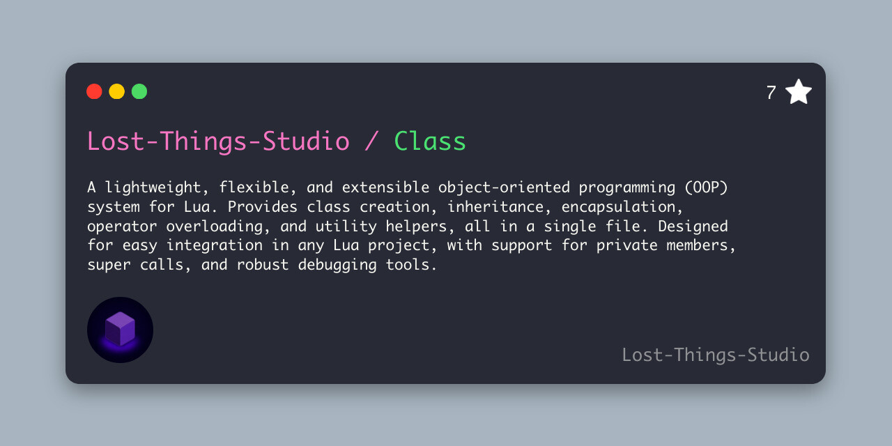

<p align="center">
  
</p>

<p align="center">
  <a href="https://github.com/Lost-Things-Studio/Class/releases">Releases</a> |
  <a href="https://github.com/Lost-Things-Studio/Class/releases/latest">Download</a> |
  <a href="https://luarocks.org/search?q=lost-class">LuaRocks</a> |
  <a href="https://lost-things-studio.github.io/Class/">Documentation</a> |
  <a href="https://lost-things-studio.github.io/Class/api/class-factory">API</a> |
  <a href="https://github.com/Lost-Things-Studio/Class/issues">Issues</a> |
  <a href="https://github.com/Lost-Things-Studio/Class/blob/main/CONTRIBUTING.md">Contributing</a>
</p>

<p align="center">
  <a href="https://github.com/Lost-Things-Studio/Class/actions/workflows/tests.yml">
    
  </a>
  <a href="https://github.com/Lost-Things-Studio/Class/actions/workflows/documentation.yml">
    
  </a>
  <a href="https://www.lua.org/">
    
  </a>
  <a href="https://luarocks.org/search?q=lost-class">
    
  </a>
</p>

<p align="center">
  <a href="https://github.com/Lost-Things-Studio/Class/releases/latest">
    
  </a>
  <a href="https://github.com/Lost-Things-Studio/Class/releases">
    
  </a>
  <a href="https://github.com/Lost-Things-Studio/Class">
    
  </a>
  <a href="https://github.com/Lost-Things-Studio/Class/blob/main/LICENSE">
    
  </a>
</p>

<p align="center">
  <a href="https://github.com/Lost-Things-Studio/Class/issues">
    
  </a>
  <a href="https://github.com/Lost-Things-Studio/Class/pulls">
    
  </a>
  <a href="https://github.com/Lost-Things-Studio/Class/stargazers">
    
  </a>
</p>

# Class

**Class** is a lightweight object-oriented helper for Lua projects that need class creation, instance initialization, inheritance-style includes, private instance state, accessor helpers, cloning, operator helpers, and debug output in a single `class.lua` file.

It is designed for projects that want OOP ergonomics without pulling a framework into the runtime.

## Why Class?

- **Single file** : Drop `class.lua` into your project or install it with LuaRocks.
- **No runtime dependency** : Pure Lua, no framework required.
- **Composable classes** : Reuse behavior with inheritance-style includes.
- **Private instance state** : Store internal data through `self.__private`.
- **Useful helpers** : Accessors, cloning, operators, and debug tools.
- **Lua 5.1+ compatible** : Tested across Lua 5.1, 5.2, 5.3, and 5.4.

## Installation

### LuaRocks

```bash
luarocks install lost-class
```

Then require the module:

```lua
local mClass = require("class")
```

> The LuaRocks package is named `lost-class`, but the Lua module remains `class`.

### Manual Installation

Copy `class.lua` into your project:

```bash
cp class.lua path/to/your/project/class.lua
```

Then require it:

```lua
local mClass = require("class")
```

## Quick Start

```lua
local mClass = require("class")

local cPlayer = mClass({
	__type = "Player",

	init = function(self, sName)
		self.name = sName
		self.__private.score = 0
	end,

	addScore = function(self, nAmount)
		self.__private.score = self.__private.score + nAmount
	end,

	getScore = function(self)
		return self.__private.score
	end,
})

local oPlayer = cPlayer("Ada")

oPlayer:addScore(10)

print(oPlayer.name)
print(oPlayer:getScore())
```

Expected output:

```txt
Ada
10
```

## Includes

Includes let you compose behavior from another class-like definition.

```lua
local mClass = require("class")

local cNamed = mClass({
	getName = function(self)
		return self.name
	end,
})

local cUser = mClass({
	__includes = cNamed,

	init = function(self, sName)
		self.name = sName
	end,
})

print(cUser("Ada"):getName())
```

## Feature Overview

| Feature | Description |
| --- | --- |
| Class creation | Build callable classes from Lua tables. |
| Instance initialization | Define an `init` method for constructor-like behavior. |
| Includes | Share methods between class definitions. |
| Private state | Use `self.__private` for per-instance internal data. |
| Accessors | Generate and manage structured access to values. |
| Cloning | Duplicate class instances when needed. |
| Operators | Add helper behavior for Lua metamethod-driven patterns. |
| Debug output | Inspect class and instance information more easily. |

## Documentation

The documentation is available here:

**[https://lost-things-studio.github.io/Class/](https://lost-things-studio.github.io/Class/)**

Run it locally:

```bash
cd docs
npm install
npm run start
```

Build the static site:

```bash
cd docs
npm run build
```

The generated site is written to `docs/build`.

## Tests

Run the Lua test suite from the repository root:

```bash
lua tests/run.lua
```

Check syntax:

```bash
luac -p class.lua tests/*.lua
```

The GitHub Actions test workflow runs on Lua 5.1, 5.2, 5.3, and 5.4.

## Release

The latest release is available here:

**[https://github.com/Lost-Things-Studio/Class/releases/latest](https://github.com/Lost-Things-Studio/Class/releases/latest)**

## Contributing

Contributions are welcome.

Please read:

- [Contributing guide](CONTRIBUTING.md)
- [Code of conduct](CODE_OF_CONDUCT.md)

## License

Class is released under the [MIT License](LICENSE).
